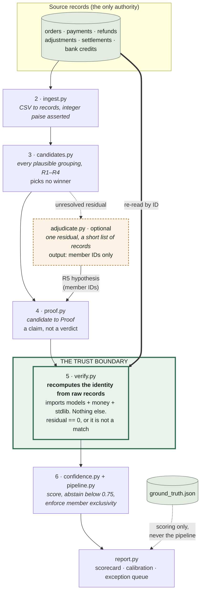

# Architecture

Six stages, one line that the model cannot cross.

Read the diagram for one thing: **every arrow into `verify.py` carries either member IDs
or raw records.** Nothing carries an amount that the verifier will trust. The model's
arrow reaches `proof.py`, never `verify.py`, and what it carries is a list of record IDs
— not a match, not a figure, not a verdict.

## The stages

| # | Module | Does | Decides |
|---|---|---|---|
| 1 | `generate.py` | Seeded synthetic batch, 13 labelled case types | nothing |
| 2 | `ingest.py` | CSV → records indexed by ID, integer-checked | nothing |
| 3 | `candidates.py` | Every plausible (credit, settlement, member-set) under R1–R4 | nothing |
| 4 | `proof.py` | Candidate → `Proof`: the identity as ordered terms | nothing |
| 5 | `verify.py` | Re-reads records by ID, recomputes, classifies the residual | **everything** |
| 6 | `confidence.py`, `pipeline.py`, `report.py` | Score, abstain, enforce exclusivity, report | what to *show*, never what is true |

`adjudicate.py` is attached to stage 3–4, not stage 5. It is the only module that can be
absent without changing anything the system claims.

## Decisions and trade-offs

**Integer paise, everywhere.** Money is `int`. `money.py` owns the type and the only
rounding helper. `tests/test_trust_boundary.py` parses every money-touching module and
fails the build on a float literal, a `round()` call, or a true division that is not a
path join. *Trade-off:* every display path has to format explicitly. Worth it — GST is
18% *of a fee*, and the rounding mode is itself one of the exception classes we detect.

**The verifier imports nothing from the matcher.** `verify.py` re-derives the ledger
identity from its own constants. `proof.py` has a second copy of that identity.
*Trade-off:* the identity is written twice, and the two could drift. That is the point —
if they drift, every proof fails loudly with `TERM_MISMATCH` instead of quietly
balancing on the wrong terms. A verifier that imported the builder would only be
checking that the code agrees with itself.

**Forgery and staleness are different failures.** A proof that contradicts *itself* —
terms, net and residual that do not add up — was edited by hand, and no code path here
can produce one; that fails outright. A proof that merely disagrees with the records is
stale, and the honest output is a residual with a diagnosis. Conflating the two made the
tamper demo say "forged" where it should have said "₹412.00 unexplained"
(see `WHAT_BROKE.md`).

**Abstention over coverage.** Confidence is deterministic: which rule fired, whether the
residual is zero, and — the part that matters — whether anything *else* also fits. Two
proofs that both balance against the same credit cap each other at 0.50, below any
usable threshold, so the system says "I do not know" rather than picking one.

*Trade-off, stated precisely, because the easy version of this sentence is false:*
dropping `--abstain-below` to 0 raises the match rate from 66.7% to 74.1% on the seed-42
batch **and still reports zero false matches**. The cap is not buying a lower false-match
rate on this data. What it is buying is visible one level down: for the
`AMOUNT_COLLISION` pair, all four credit-to-settlement pairings balance to exactly zero
paise, so at threshold 0 the winner is decided by the exclusivity tie-break sorting
proof IDs — and on this seed that coin flip lands on the correct permutation. The system
would have been *right*, with no evidence, and the metric would have taken the credit.
`tests/test_pipeline.py::TestAmbiguityIsNotResolvedByLuck` pins all four of those facts
so that zero cannot later be read as a result.

**A FAIL is never promoted.** There is no branch where a high score rescues a proof that
did not balance. `abstains()` is one boolean and it reads that way on purpose.

**An LLM hypothesis is the weakest thing we accept.** `R5_LLM_HYPOTHESIS` scores 0.77
after the zero-residual bonus — one notch above the 0.75 default threshold, and below
every deterministic rule. Raise `--abstain-below` at all and every model-proposed match
leaves the scorecard. *Trade-off:* the layer is easy to switch off, which is exactly what
"not load-bearing" has to mean in practice.

**Subset search is capped** at size 3 and a 5-day window, because an uncapped search over
150 records does not finish. Cap hits are counted and reported rather than hidden; on the
seed-42 batch the count is zero, so the cap costs nothing *on this data* and would cost
something on a real one.

**Ground truth is loaded in exactly one place.** `report.py`, after the pipeline has
finished. The generator writes it to a separate file, and no module upstream of scoring
imports it. The pipeline cannot peek at the answers because it has never been handed
them.

**Seeded and byte-identical.** `--seed 42` reproduces the CSVs byte for byte —
`.gitattributes` forces LF checkout so that stays true on Windows — and every line of
`RESULTS.md` except the wall-clock throughput row. A tampered run writes to
`RESULTS.tampered.md` so a demo cannot overwrite the committed numbers, which is a
mistake this project has already made once.

**No build step for the dashboard.** Plain HTML, CSS and ES modules served by FastAPI.
A judge should not need Node to see the demo, and a committed `dist/` nobody can rebuild
is worse than no `dist/` at all. *Trade-off:* no JSX, no bundler, hand-written DOM. The
UI is tables and rules; a component kit would have fought the design.
