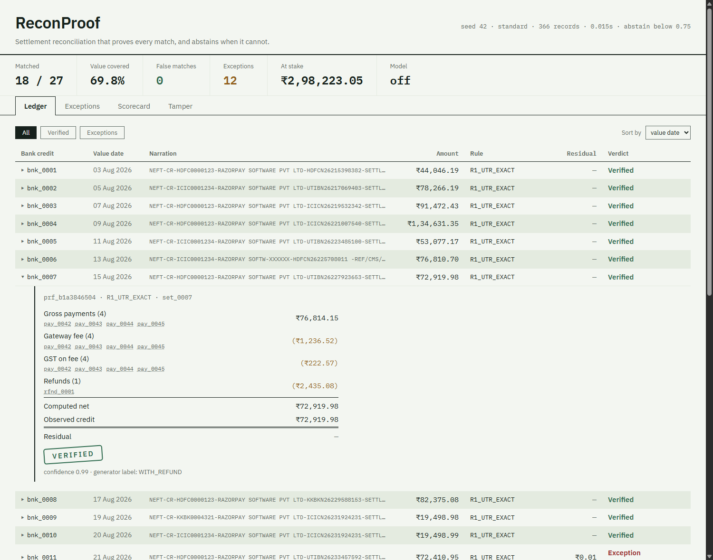
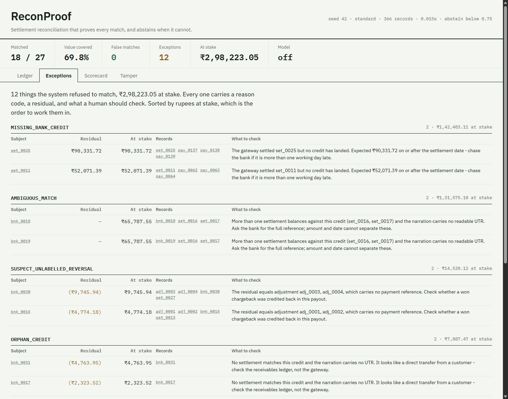
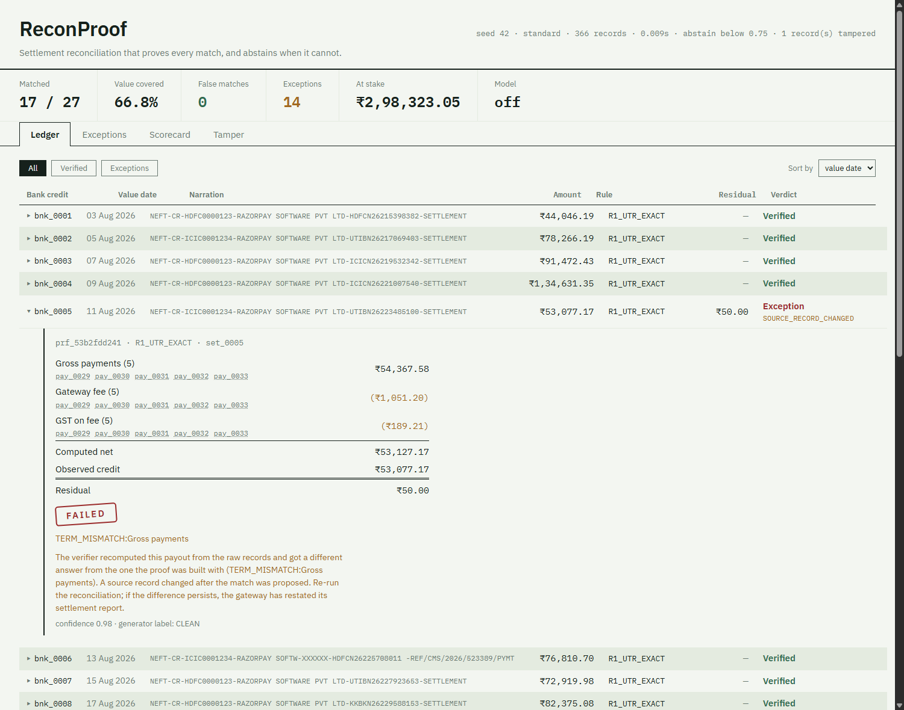
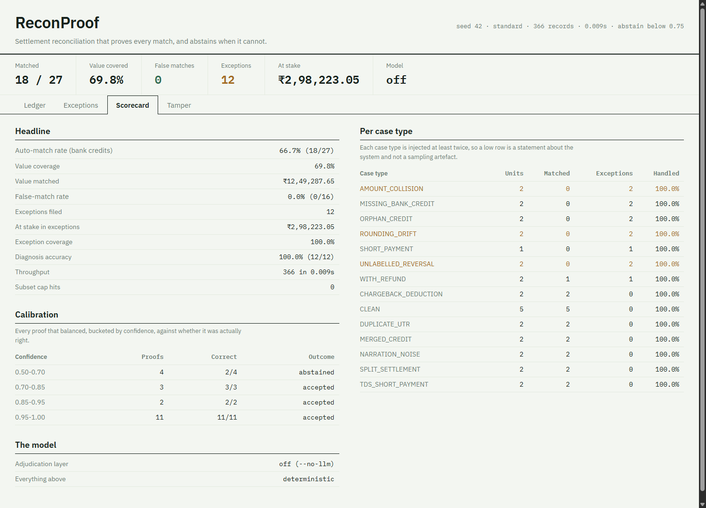

# ReconProof

A settlement-reconciliation agent that **proves** every match it makes, **quantifies**
how sure it is, and **abstains** when it cannot prove the answer.
Razorpay AI Buildathon — **Track 04, AI Finance Controller**.

## Run it

No API key. Nothing to configure. About 40 seconds from a clean clone.

```bash
python -m venv .venv
.venv\Scripts\activate            # Windows;  source .venv/bin/activate elsewhere
pip install -r requirements.txt

python -m pytest -q               # 135 tests, including the ones that attack the verifier
.\run.ps1                         # or:  PYTHONPATH=src python -m reconproof.run --no-llm --seed 42
```

That writes `report.json` and `RESULTS.md` and prints the scorecard below. Then:

```bash
.\run.ps1 --tamper pay_0031 --tamper-delta 5000   # corrupt a record; watch a proof flip to FAIL
.\run.ps1 --show bnk_0007                         # print one proof's full derivation
.\run.ps1 --difficulty hard                       # more hard cases, and a lower match rate

python -m reconproof.serve                        # the dashboard on http://127.0.0.1:8000
```

The dashboard needs no Node and has no build step: FastAPI serves plain HTML,
CSS and ES modules out of [`web/`](web/).

## The scorecard

`--seed 42 --difficulty standard --no-llm`, reproduced in full in
[RESULTS.md](RESULTS.md). 366 records: 151 orders, 151 payments, 27 settlements,
31 bank credits, refunds and adjustments.

| Metric | Value |
| --- | --- |
| Auto-match rate (bank credits) | **66.7%** (18/27) |
| Value coverage | **69.8%** (₹12,49,287.65 of ₹17,90,945.93) |
| **False-match rate** | **0.0%** — 0 of 16 accepted proofs |
| Exceptions filed | 12, ₹2,98,223.05 at stake, every one with a typed reason |
| Diagnosis accuracy | 100% (12/12 unmatched units given the right reason code) |
| Throughput | 366 records in ~0.01s |

The match rate is not the number to look at. **The false-match rate is.** A
66.7% match rate with zero wrong matches and a precise exception list is worth
more to a finance team than a 96% rate they have to audit by hand, and it is
the only thing consistent with the track's own bar.

And the false-match rate on its own is not enough either: on this batch the
system scores 0 false matches *even with abstention switched off entirely*, by
guessing correctly on a pair it has no evidence about. That is written up in
["What it cannot do"](#what-it-cannot-do) and in `WHAT_BROKE.md`, because a
metric that cannot tell a deduction from a lucky guess is worth saying out loud
before someone else finds it.

With `--llm` the match rate rises, because the model resolves three residuals
the deterministic rules abstain on. It rises *through* the verifier, not around
it: see "The trust boundary" below.

### It falls where it should

One number on one batch proves nothing, so here it is across all three
difficulty settings. This table is *measured on every run* and written into
[RESULTS.md](RESULTS.md) rather than typed in, so it cannot go stale behind a
change to the generator (`--no-sweep` skips it).

| Difficulty | Records | Match rate | Value coverage | Exceptions | False matches |
| --- | ---: | ---: | ---: | ---: | ---: |
| easy | 474 | 72.7% (24/33) | 78.8% | 12 | **0** |
| standard | 366 | 66.7% (18/27) | 69.8% | 12 | **0** |
| hard | 465 | 54.5% (18/33) | 64.9% | 18 | **0** |

The match rate falls as the hard cases multiply. The false-match rate does not
move, which is the property worth having.

A note on what the seed does *not* do: it varies amounts, dates and narrations
but not the mix of case types, so ten different seeds give ten identical match
rates. That confirms determinism and says nothing about robustness, which is
why the table above varies difficulty instead. `tests/test_pipeline.py::TestTheMatchRateFallsWhereItShould`
asserts both halves of it.

## The problem

A payment gateway does not forward each sale. It batches them and sends one
lump credit on a T+n cycle, after taking its cut. So a ₹4,14,382 bank credit is
never a clean sum of orders — it has been reduced by the gateway fee, by 18%
GST *on that fee*, by refunds from an earlier cycle whose original fee was not
reversed, and by chargeback deductions; and increased by chargeback reversals
that arrive weeks later as unlabelled adjustments carrying no reference to the
payment they reverse. India adds TDS: a business customer withholds 10% at
source, so the payment is smaller than the order and looks exactly like a
partial payment.

The identity that has to close, to the paisa:

```
  Σ payment.amount
− Σ payment.fee
− Σ payment.tax                (GST on the fee)
− Σ refund.amount
− Σ chargeback_deduction.amount
+ Σ chargeback_reversal.amount
= bank_credit.amount
```

Zero residual, or it is not a match. When it does not close, **the residual is
the diagnosis** — its size and sign say what is missing.

## How it works

1. **Generate** — `generate.py` builds a seeded synthetic batch with 13
   labelled hard-case types (clean, cross-cycle refund, chargeback deduction,
   unlabelled reversal, split settlement, merged credit, rounding drift, amount
   collision, narration noise, missing credit, orphan credit, TDS short
   payment, duplicate UTR). Ground truth is written to a separate file the
   pipeline never reads.
2. **Ingest** — `ingest.py` reads the six CSVs into records indexed by ID,
   asserting integer paise at the boundary.
3. **Propose** — `candidates.py` generates *every* plausible (credit,
   settlement, member-set) grouping under four deterministic rules — UTR from
   the narration, amount within a ±3-day window, subset-split, subset-merge —
   and picks no winner. Choosing is not its job.
4. **Prove** — `proof.py` turns each candidate into a `Proof`: the ledger
   identity as an ordered list of terms, each carrying the record IDs it was
   computed from. A proof is a claim, not a verdict.
5. **Verify** — `verify.py` re-reads every member record by ID and recomputes
   the whole identity from scratch. Zero residual is the only thing that
   passes. Everything else gets a classified reason.
6. **Score and file** — `confidence.py` scores what fired and whether anything
   else also fits, abstaining below 0.75; `report.py` writes the scorecard,
   the calibration table, the per-case-type breakdown and the exception queue
   sorted by rupees at stake.

`adjudicate.py` sits beside stage 5 as an optional layer, and is the subject of
the next section.

## The trust boundary

**The LLM proposes. The verifier disposes.**

The model is never permitted to declare a match. It is handed one unexplained
residual and a short list of records the deterministic rules could not place,
and asked which of them, if any, would make the payout balance. Its answer is a
list of IDs — nothing else. That list is rebuilt into a proof by the same
builder every deterministic rule uses and pushed through the same `verify()`
call, and it is accepted only if the arithmetic closes to exactly zero paise.

There is no code path into a match that skips that. You do not have to take my
word for it:

- **Read [`src/reconproof/verify.py`](src/reconproof/verify.py).** It imports
  `models`, `money` and the standard library. Nothing else — not the candidate
  generator, not the proof builder, not any HTTP client.
- **Run `pytest tests/test_trust_boundary.py`.** It parses the verifier's
  imports and fails the build if that ever stops being true. It also fails if a
  float literal appears in any module that touches money.
- **Run `pytest tests/test_verify.py`.** Corrupt a payment amount and the proof
  flips to `FAIL` naming the term that moved. Hand-forge `computed_net` and it
  is rejected. List a member that does not belong, or the same payment in two
  proofs, and both fail.
- **Run `pytest tests/test_llm_layer.py`.** A stub model that is confidently
  and always wrong changes the match rate by exactly zero.

The report states how many hypotheses the model proposed and how many survived
verification, because that number — not an impression of model quality — is
the honest measure of what the model is worth here.

## What it cannot do

Stated here rather than left for someone to find.

- **Subset search is capped** at 3 records and a 5-day window. An uncapped
  search over 150 records does not finish. Every time the cap is hit it is
  counted and reported (`subset_cap_hits`); on the seed-42 batch it is hit zero
  times, which means the cap costs nothing *on this data* and would cost
  something on a real one.
- **`AMOUNT_COLLISION` abstains by design.** Two settlements, same date,
  identical net, no readable UTR. All four credit-to-settlement pairings
  balance to exactly zero paise — two of them are wrong, and no amount of
  arithmetic can say which. It files `AMBIGUOUS_MATCH` naming both candidates.
  That is two of the nine unmatched credits, and it is the correct answer.
  Setting `--abstain-below 0` matches them anyway and still reports zero false
  matches, because the tie-break happens to pick the right permutation on this
  seed. That is luck, not a result — `TestAmbiguityIsNotResolvedByLuck` in
  `tests/test_pipeline.py` says so in four assertions.
- **`ROUNDING_DRIFT` is not auto-accepted.** A one-paisa residual is still a
  residual. `--tolerance-paise 5` accepts it, and the default is 0, because how
  much unexplained money is acceptable is a policy decision and not the
  verifier's to make quietly.
- **Loop B is shallow.** Order-versus-payment catches short payments and
  distinguishes TDS withholding from a genuine partial, and does no more.
- **The data is synthetic**, modelled on the structure of a public Razorpay
  settlement report — fee, GST on fee, refunds, adjustments, UTR narrations. It
  is not real merchant data, and the generator's hard cases are the hard cases
  I know about.
- **The dashboard is desktop-only** (1280px and up). Mobile is not attempted
  rather than half-attempted.

## Adding an exception type

The taxonomy is meant to grow. To add one:

1. Add the detection to `classify_residual()` in `verify.py`, returning a
   reason code and the record IDs a human should look at. Order matters: an
   exact amount match against a record that exists beats an arithmetic
   coincidence, so put it above the proportional checks.
2. Add the human-facing sentence — *what should someone actually check* — to
   `GUIDANCE` / `_guidance()` in `pipeline.py`. Never emit a bare "could not match".
3. If it is a whole new shape of failure rather than a residual, add a
   `case_type` to `generate.py` so it appears in the per-case-type breakdown,
   and label at least two instances.
4. Add a test in `tests/test_verify.py` that constructs the residual and
   asserts the reason code. The taxonomy is only as honest as its tests.

## The optional LLM layer

```bash
pip install -r requirements-llm.txt
cp .env.example .env    # add GROQ_API_KEY
.\run.ps1 --llm
```

`llama-3.3-70b-versatile` on Groq, `temperature=0`, responses cached to
`.llm_cache.json` keyed by a hash of the prompt so reruns are free and offline.
It is an enhancement layer and never load-bearing: `--no-llm` is the default
and produces the complete scorecard above.

## Layout

```
src/reconproof/
  money.py         integer paise, Indian digit grouping, half-up GST
  models.py        source records + the Proof schema
  generate.py      seeded synthetic batch, 13 labelled hard cases
  ingest.py        CSV -> records, indexed by ID
  candidates.py    deterministic candidate generation (4 rules, no winner picked)
  proof.py         candidate -> Proof
  verify.py        THE VERIFIER. No matcher imports, no LLM, no floats.
  confidence.py    deterministic scoring and the abstention threshold
  adjudicate.py    optional LLM proposer
  pipeline.py      the six stages, in order
  report.py        scorecard, RESULTS.md, report.json
  run.py           CLI
  serve.py         the dashboard
tests/             135 tests; test_verify.py and test_trust_boundary.py are the pitch
data/generated/    the committed seed-42 batch
```

## The dashboard

`python -m reconproof.serve`, then <http://127.0.0.1:8000>. Four screens, and
the view lives in the URL - `#/ledger/bnk_0015` opens that credit's derivation.

**The ledger.** One row per bank credit. Click a row and the derivation opens
underneath it: the identity as an accounting statement, every source ID a link
to the raw record, a single rule above the subtotal and a double rule under the
total. Same-day post-and-reverse pairs are struck through rather than counted
as failures.



**The exception list.** Grouped by reason code, sorted by rupees at stake,
every row saying what a human should actually check. This screen is the direct
answer to the track's bar.



**The tamper demo.** Corrupt one source amount and re-verify. The proofs are
not rebuilt - only the verifier reads the data again - so when the stamp flips
to FAILED it flips because the arithmetic stopped holding, and the reason names
the term that moved. The button calls the same `apply_tamper` and `verify` that
the CLI's `--tamper` calls; nothing on this screen is mocked.



**The scorecard.** Match rate by record and by value, false-match rate,
calibration, and the per-case-type breakdown with the weakest rows sorted to
the top and flagged.



Desktop only, 1280px and up. Mobile is not attempted rather than half-attempted.

## More

[ARCHITECTURE.md](ARCHITECTURE.md) has the diagram and the design trade-offs.
[WHAT_BROKE.md](WHAT_BROKE.md) has the incidents.

MIT licensed.
